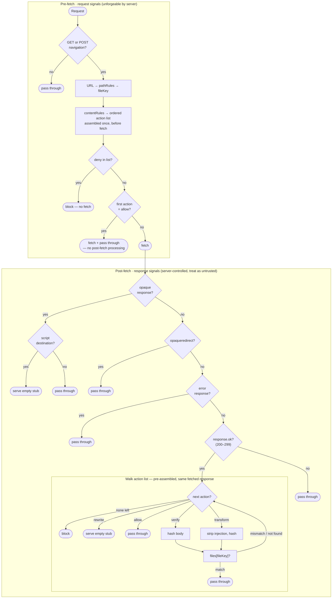

# Manifest Rules Design

## Overview

The integrity manifest (`integrity-manifest.json`) maps file paths to SHA-256 hashes. The service
worker fetches every intercepted response, hashes it, and checks it against this map.

Beyond the core hash map, the manifest carries two optional rule sets that handle real-world hosting
complexity:

-   **`pathRules`** — ordered list of named resolution rules that map clean URLs (extensionless,
    trailing-slash variants) to canonical file keys before any hash check.
-   **`contentRules`** — determines how to verify content once the canonical key is known. Rules are
    evaluated in order; the first rule whose action _succeeds_ wins. This allows fallback chains:
    e.g. try `verify`, and if the hash is unknown fall through to `rewrite`.

The `condition`/`action` structure of `contentRules` is intentionally aligned with Chrome's
`declarativeNetRequest` — see [Extension Compatibility](#extension-compatibility) for why.

---

## Verification pipeline

Two distinct phases with different available signals.



**Key properties:**

-   Only **GET** requests and **POST navigation** requests (`<form method="POST">` submissions where
    `request.mode === 'navigate'`) enter the verification pipeline. All other methods are passed
    through without verification. See [HTTP method handling](#http-method-handling) for the
    rationale.
-   `contentRules` conditions are evaluated pre-fetch — only request signals needed (canonical file
    key + `request.destination`). All matching rules are collected into an ordered action list. The
    list is then walked post-fetch against the already-fetched response body.
-   `deny` and `allow` are the only actions resolved pre-fetch. `deny` blocks without fetching.
    `allow` as the first action fetches the resource and passes it through directly — the entire
    post-fetch pipeline is skipped. All other actions require the response body and are applied in
    the post-fetch phase.
-   An `allow` action at the head of the list is how a trusted cross-origin opaque script is
    permitted to execute — the SW does not attempt to inspect or hash the body at all.
-   Opaque responses (`response.type === "opaque"`) cannot be hashed — the body is inaccessible to
    SW JavaScript (`response.arrayBuffer()` returns an empty buffer). Handling (for non-allow
    actions) depends on `request.destination`:
    -   **`"script"`** — rewrite to empty stub. "Opaque" is an API-level restriction: the browser's
        internal network layer still has the actual bytes and will execute them. A cross-origin
        classic script (`<script src>` without `crossorigin`) loaded in `no-cors` mode produces an
        opaque response in the SW but is still executed by the browser, so it must be neutralized.
    -   **All other destinations** (`"image"`, `"font"`, `"audio"`, `"video"`, etc.) — pass through.
        These resources can be rendered or used by the browser, but their bytes cannot be exposed to
        or executed as code by the page, so an unverified opaque response carries no
        script-injection risk.
-   Opaqueredirect responses (`response.type === "opaqueredirect"`) occur when the browser makes a
    navigation request and the server returns a 3xx redirect. The browser passes the navigation to
    the SW with `redirect: "manual"`, so the SW sees an opaqueredirect instead of following the
    redirect chain. The body is empty and inaccessible — `arrayBuffer()` returns zero bytes. The SW
    passes these through unconditionally (SKIPPED); the browser then follows the redirect and makes
    a new navigation request to the final URL, which the SW intercepts and verifies normally.
    Attempting to hash an opaqueredirect produces the SHA-256 of an empty buffer
    (`sha256-47DEQpj8HBSa+/TImW+5JCeuQeRkm5NMpJWZG3hSuFU=`) — a constant value that would produce a
    false violation on every redirect. This is distinct from `opaque` (no-cors cross-origin
    response) — they share the inaccessible-body property but arise from completely different
    request modes.
-   Error responses (`response.type === "error"`) indicate a network failure. The body is null,
    status is 0, and there is nothing to hash. For non-document destinations these are already
    caught by the `!response.ok` guard above; the explicit check here covers document navigations
    where the browser renders its own error UI regardless of what the SW returns.
-   Only `response.ok` responses (status 200–299) enter the verification walk — 4xx and 5xx
    responses are passed through without verification. Within the 2xx range, only the body hash
    matters; if the body is empty (e.g., a 204 sent to a script endpoint), the hash-of-empty either
    matches the manifest entry or triggers a violation — there is no special-case bypass for any 2xx
    code. Gating on `response.ok` rather than `status === 200` is intentional: status codes such as
    203 (Non-Authoritative Information, returned by transforming proxies) carry an executable body
    that the browser will run, so they must be verified. For non-navigation requests, `fetch()` uses
    `redirect: 'follow'` by default, so the SW always sees the final 200 response — there is no
    redirect-chain bypass for assets. Navigation requests use `redirect: 'manual'` and produce
    `opaqueredirect` responses on server redirects; these are handled by the check above.
-   `Content-Type` is never consulted. All destinations, including `""` (`fetch()`,
    `XMLHttpRequest`), go through the same pipeline: pathRules resolution, contentRules action list,
    then `files[key]` lookup. The default when no action succeeds is **block** — unrecognized URLs
    are denied, not passed through. Dynamic endpoints (APIs, CDN resources) must be explicitly
    covered by a contentRule `allow` action. This means a `fetch('/app.js')` that the app might eval
    is verified against the manifest hash exactly like any other GET request — Content-Type is not
    needed and is server-controlled anyway.

---

## Manifest format

```json
{
    "files": {
        "/app.js": "sha256-...",
        "/about/index.html": "sha256-...",
        "/about/index.html#scripts": ["sha256-init", "sha256-hydrate"],
        "/about/index.html#handlers": ["sha256-handler-1"],
        "/about/index.html#importmap": ["sha256-importmap-1"],
        "/.netlify/scripts/cdp": ["sha256-v1", "sha256-v2"]
    },
    "pathRules": [{ "type": "directory-index" }],
    "contentRules": [
        {
            "condition": { "resourceTypes": ["document"] },
            "action": { "type": "transform", "transform": "netlify-cdp" }
        },
        {
            "condition": { "urlFilter": "/.netlify/scripts/cdp" },
            "action": { "type": "verify" }
        },
        {
            "condition": { "urlFilter": "/.netlify/scripts/cdp" },
            "action": { "type": "rewrite" }
        },
        {
            "condition": { "urlFilter": "/_server-islands/" },
            "action": { "type": "allow" }
        }
    ],
    "mode": "protected",
    "metadata": {}
}
```

### `files` — backward compatible

-   String value: single known hash.
-   Array value: multiple known-good hashes (e.g., CDN scripts with rolling versions).
-   Manifests with only `files` + `mode` + `metadata` work without any rules.

**Synthetic `#`-prefixed keys** — keys of the form `pageKey + "#scripts"`, `pageKey + "#handlers"`,
and `pageKey + "#importmap"` hold per-page extraction sets. Browsers always strip URL fragments
before SW dispatch, so `#` can never appear in a real request key — making it an unambiguous
namespace for these entries. Each value is an array of content hashes verified as a set-membership
check (not positional). See [Inline script verification](#inline-script-verification) and
[Handler and importmap verification](#handler-and-importmap-verification).

---

## Evaluation pipeline

```
request URL
  → resolveManifestKey()  same-origin → pathname; cross-origin → full URL
  → pathRules lookup      alias → canonical file key  (same-origin only, optional)
  → contentRules          first successful match → action
  → files[fileKey]        direct lookup (for verify / transform actions)
```

---

## pathRules

### Format: ordered rules, named types

```json
"pathRules": [
  { "condition": { "urlFilter": "/docs/" }, "type": "directory-index" },
  { "match": "/landing", "resolveAs": "/campaigns/landing/index.html" },
  { "type": "html-extension" }
]
```

Rules are evaluated in order. A rule **succeeds** when it's named type resolves the path to a
candidate key that exists in `files`. On success, evaluation stops. On failure, the next rule is
tried.

**`type`** — named resolution from the closed set defined in
[Named operations reference](#named-operations-reference). Determines how the incoming path is
transformed to a candidate key; success requires `files[candidateKey]` to exist.

**`condition.urlFilter`** — optional prefix. Rule only applies to paths that start with this string.
Absent condition matches all paths.

**`match` + `resolveAs`** — explicit one-to-one override. Always succeeds (terminal). Use for
exceptions that do not follow the site-wide pattern.

For most sites a single rule is enough:

```json
"pathRules": [{ "type": "directory-index" }]
```

### Who emits pathRules

The `@dappfence/astro-integration` emits one rule based on the build format:

-   `build.format = 'directory'` → `[{ "type": "directory-index" }]`
-   `build.format = 'file'` → `[{ "type": "html-extension" }]`

Explicit `match/resolveAs` overrides are never emitted by the integration — they are for manual use
in non-standard configurations.

### Default (no pathRules)

Exact lookup in `files` only.

---

## contentRules

### Format: ordered list, first successful match wins

```json
"contentRules": [
  {
    "condition": { "resourceTypes": ["document"] },
    "action":    { "type": "transform", "transform": "netlify-cdp" }
  },
  {
    "condition": { "urlFilter": "/.netlify/scripts/cdp" },
    "action":    { "type": "verify" }
  },
  {
    "condition": { "urlFilter": "/.netlify/scripts/cdp" },
    "action":    { "type": "rewrite" }
  },
  {
    "condition": { "urlFilter": "/_server-islands/" },
    "action":    { "type": "allow" }
  }
]
```

Rules are evaluated against the **canonical key** (after pathRules resolution) in two phases:

**Pre-fetch** — all rules whose condition matches the request are collected into an ordered action
list. No `body` is available yet; only the canonical key and `request.destination` are used.

**Post-fetch** — the collected action list is walked against the already-fetched response body. The
first action that **succeeds** wins; `verify` and `transform` actions that fail (hash mismatch or
key not in `files`) fall through to the next action in the list. There is no second network request.

The `/.netlify/scripts/cdp` pair above illustrates a fallback chain: `verify` succeeds when the
script hash is known and matches; if the hash is unknown or changed, `verify` fails and the next
matching action fires — `rewrite` replaces the body with an empty stub.

### `condition` fields

Both fields are optional and AND-ed together when both are present. An absent `condition` matches
every request.

**`urlFilter`** — exact prefix string against the canonical file key.

**`resourceTypes`** — array of `request.destination` values from the Fetch spec. The SW reads
`request.destination` directly so the manifest uses the same names — no translation layer. The
`condition`/`action` structure mirrors Chrome `declarativeNetRequest`, but the value names follow
the Fetch spec (`"style"` not `"stylesheet"`, `""` not `"xmlhttprequest"`).

All valid values:

| Value             | Triggered by                                                                              |
| ----------------- | ----------------------------------------------------------------------------------------- |
| `"document"`      | top-level navigation, `<iframe>`                                                          |
| `"script"`        | `<script>`, dynamic `import()`                                                            |
| `"style"`         | `<link rel="stylesheet">`, CSS `@import`                                                  |
| `"font"`          | `@font-face`                                                                              |
| `"image"`         | ``, CSS `background-image`, `<picture>`                                              |
| `"audio"`         | `<audio>`                                                                                 |
| `"video"`         | `<video>`                                                                                 |
| `"worker"`        | `new Worker()`                                                                            |
| `"serviceworker"` | service worker registration                                                               |
| `"manifest"`      | `<link rel="manifest">`                                                                   |
| `"track"`         | `<track>` (subtitles / captions)                                                          |
| `"embed"`         | `<embed>`                                                                                 |
| `"object"`        | `<object>`                                                                                |
| `""`              | `fetch()`, `XMLHttpRequest`, `navigator.sendBeacon()`                                     |
| `"inline-script"` | synthetic — DappFence only; see [Inline script verification](#inline-script-verification) |

The most commonly used in rules: `"document"`, `"script"`, `"style"`, `""`.

### `action` types

| `type`        | Succeeds when                                              | Fails when                                          |
| ------------- | ---------------------------------------------------------- | --------------------------------------------------- |
| `"verify"`    | Hash matches `files[key]` → pass through                   | Hash mismatch or key not in `files` → try next rule |
| `"transform"` | Hash matches after applying named transform → pass through | Hash mismatch or key not in `files` → try next rule |
| `"allow"`     | Always — pass through without verification                 | Never                                               |
| `"deny"`      | Always — block unconditionally                             | Never                                               |
| `"rewrite"`   | Always — replace body with empty stub                      | Never                                               |

`allow`, `deny`, and `rewrite` are terminal: they never fall through. `verify` and `transform` fall
through on failure, enabling the fallback patterns shown in the example above.

`deny` and `allow` are also resolved **pre-fetch** when they appear first in the assembled action
list — `deny` blocks without fetching, `allow` fetches and returns without entering the post-fetch
pipeline. When `allow` appears later in the list (as a fallback after a `verify` or `transform`
failure) it is resolved post-fetch inside the walk, as shown in the diagram.

### `transform` — closed set, security-critical

Transform names reference a fixed set defined in `rules.js` in the SW bundle. The manifest can only
_name_ a transform — it cannot define new ones. Arbitrary patterns cannot be injected through the
manifest.

Current transforms: `netlify-cdp` (strips Netlify's CDP injection from HTML).

### Why no general wildcards in contentRules

Two properties of the design make wildcards unnecessary:

1. **pathRules resolves paths first.** By the time contentRules evaluate, the key is always a
   canonical path with an extension (`/about/index.html`, not `/about`). No rule needs to match
   extensionless variants.

2. **`resourceTypes` replaces content-category globs.** `{ "resourceTypes": ["document"] }` catches
   all HTML navigations without any path pattern.

What remains is exact prefix matching for path-scoped rules, which is straightforward and auditable.

### Default (no contentRules)

Plain verify against `files[key]`, no transforms, no allow/deny overrides. If `files[key]` is not
found, the action list is exhausted and the request is **blocked**. Dynamic endpoints (APIs, CDN
resources) require an explicit `allow` contentRule.

### Cross-origin `<embed>` and `<object>` (PDFs, plugins)

`<embed>` and `<object>` elements load content with `destination="embed"` or `destination="object"`.
When the source is cross-origin and the CDN does not support CORS, the browser issues a `no-cors`
request. DappFence upgrades `no-cors` requests for executable destinations to `cors+omit` so the
response body is readable for hash verification — but a CDN without CORS support will reject the
upgraded request and the embed will break.

**Required manifest rule:**

```json
{
    "contentRules": [
        {
            "condition": { "resourceTypes": ["embed", "object"] },
            "action": { "type": "allow" }
        }
    ]
}
```

With this rule in place:

1. `prepareRequest` detects the `allow` match before applying the CORS upgrade and returns the
   original request unchanged — the CDN receives its expected `no-cors` request.
2. `verifyResponse` sees the opaque response and skips verification (opaque bodies are unreadable).

Without the rule, the CORS upgrade fires unconditionally and the embed fails on CDNs that do not
support CORS.

Scope the rule to a `urlFilter` prefix if you only want to allow specific origins:

```json
{
    "condition": {
        "urlFilter": "https://docs.example.com/",
        "resourceTypes": ["embed", "object"]
    },
    "action": { "type": "allow" }
}
```

Same-origin `<embed>`/`<object>` elements do not need this rule — same-origin responses are always
readable and are verified normally against `files[key]`.

---

## Named operations reference

The SW bundle defines the implementation for each entry below. The manifest can reference names from
these sets but cannot introduce new logic. Adding support for a new platform requires a new entry
here and a matching implementation in the bundle — it cannot be done through the manifest alone.

### pathRules types

#### `directory-index`

Resolves extensionless and trailing-slash paths to their `index.html` form:

-   `/about` → `/about/index.html`
-   `/about/` → `/about/index.html`
-   Paths that already carry a file extension pass through unchanged (rule fails, evaluation
    continues to the next rule).

Use when: `build.format = 'directory'` — Astro, Next.js static export, most Netlify and Vercel
deployments.

#### `html-extension`

Resolves extensionless paths to their `.html` form:

-   `/about` → `/about.html`
-   Paths with an extension or trailing slash pass through unchanged.

Use when: `build.format = 'file'` (Astro file mode).

#### `not-found`

Maps any URL that is not already in `manifest.files` to a known fallback key, so the SW can verify
the response body rather than unconditionally blocking the request.

```json
{ "type": "not-found", "fallback": "/404" }
```

-   Only activates when the resolved pathname has no entry in `files` (known paths are never
    re-routed to the fallback).
-   Only activates when the response is non-OK (4xx/5xx). A 200 for an unknown path is
    `NOT_FOUND_IN_MANIFEST` — the server should not be claiming a known page for an unmanifested
    URL.
-   The `fallback` key must exist in `files`; if it doesn't, the rule is skipped.
-   A matching response body is allowed through; a mismatched or missing body is blocked as a
    security violation.
-   Supports `condition.urlFilter` to scope the fallback to a URL prefix. Rules are evaluated in
    order; the first matching rule wins. This enables section-specific 404 pages:

```json
{ "condition": { "urlFilter": "/admin/" }, "type": "not-found", "fallback": "/admin/404.html" },
{ "type": "not-found", "fallback": "/404.html" }
```

-   Multiple known-good 404 bodies (e.g. A/B tested page) are handled by making the fallback `files`
    entry an array of hashes — no rule change needed.

**Why this matters**: without the rule, any URL not listed in the manifest is blocked immediately
(`NOT_FOUND_IN_MANIFEST`). That is safe but unfriendly — legitimate 404 pages are indistinguishable
from unknown responses. With the rule the SW verifies the 404 body against the known hash, letting
through a genuine "Page Not Found" page while still catching tampered responses.

**Use when**: the server returns a 404 page body directly at the requested URL without redirecting
(Next.js SSR, Express-style servers). Static-export hosts that 302-redirect unknown paths to a
`/404/` route don't need this rule because the redirect creates a second navigation request that
resolves through `directory-index`.

---

### contentRules transform

#### `netlify-cdp`

Strips Netlify's Connect Data Platform (CDP) injection from HTML document responses before hashing,
so the computed hash matches the pre-deployment source recorded in the manifest.

**What Netlify injects** (at CDN serve time, after build):

```html
<div
    data-netlify-deploy-id="<hex>"
    data-netlify-site-id="<uuid>"
    data-vcs="github"
    style="position:fixed"
>
    <script async src="/.netlify/scripts/cdp"></script>
</div>
```

**Pattern matched and stripped** (applied only to `.html` and `.htm` files):

```
<div data-netlify-deploy-id="[0-9a-f]+" data-netlify-site-id="[0-9a-f]{8}-[0-9a-f]{4}-[0-9a-f]{4}-[0-9a-f]{4}-[0-9a-f]{12}" data-vcs="github" style="position:fixed">\s*<script async src="/.netlify/scripts/cdp"></script>\s*</div>
```

**Why a regexp is safe here**

Using a regexp to strip known CDN injection is a deliberate tradeoff. Security depends on three
properties being jointly true:

1. **The pattern is hardcoded in the SW bundle.** The manifest only names `"netlify-cdp"` — it
   cannot supply or modify the pattern. An attacker who controls the manifest cannot change what
   gets stripped.

2. **The pattern is structurally narrow.** Both `data-netlify-deploy-id` (hex characters only) and
   `data-netlify-site-id` (UUID format only) must be present with their exact attribute names and
   constrained value formats. The only variable content is the hex deploy ID and the UUID site ID —
   neither can contain HTML markup, script content, or closing-tag sequences that could break the
   match boundary.

3. **`\s*` is the only flexible interior match.** Whitespace is the only thing permitted between
   `<div ...>` and `<script ...>`, and between `</script>` and `</div>`. Whitespace cannot carry
   executable content, so nothing meaningful can hide inside the stripped block.

Additionally: the operation is `content.replace(pattern, '')` — it only removes bytes, never adds
them. The post-strip content is a strict subset of the original. There is no ReDoS risk: the pattern
has no nested quantifiers or polynomial ambiguity; `\s*` sits between two fixed-string anchors.

---

## Inline script verification

Static file verification works because the full response body is known at build time and hashed into
the manifest. Inline `<script>` content inside an HTML page shares the same risk profile as external
scripts — it executes in the page context — but it has no URL, so it cannot be intercepted as a
separate fetch event.

This applies to any HTML response: static pages, SSR pages, and POST navigation responses (`form`
submissions that return HTML directly rather than redirecting).

### Synthetic `inline-script` destination

After the SW fetches and decodes an HTML document, it extracts all executable inline scripts and
re-runs them through the pipeline as virtual requests with `destination: "inline-script"` and file
key `pageKey + "#scripts"`. The full contentRules action pipeline applies: `verify`, `transform`,
`rewrite`, and `allow` work identically to external resources.

```json
"contentRules": [
  { "condition": { "resourceTypes": ["inline-script"] },
    "action": { "type": "verify" } },

  { "condition": { "resourceTypes": ["inline-script"], "urlFilter": "/dashboard" },
    "action": { "type": "transform", "transform": "strip-nonce" } }
]
```

### Extraction

A named extractor (`"inline-scripts"`, from the closed set) identifies executable inline script
content:

1. Finds all `<script>` tags with no `src` attribute.
2. Keeps only executable types: no `type`, `text/javascript`, `module`.
3. Skips `type="application/json"` — these are data islands; the browser does not execute them as
   code.
4. Returns the text content of each remaining tag for hashing.

### Verification

Each extracted script is hashed and checked against `files[pageKey + "#scripts"]` as a
**set-membership** check — order-independent, same semantics as multi-hash file entries. Every
script must match an entry in the set. Any script with no matching hash is a violation. Hashes in
the set that no extracted script matches are silently ignored — they represent other valid versions,
not required scripts.

Inline script verification runs as a **separate post-fetch phase**, independently of the document's
contentRule action. An `allow` action on the document skips body hash verification but does not
bypass inline script verification — both phases always run for HTML responses that have a `#scripts`
entry in `files`.

**For SSR pages** — the body is dynamic and unverifiable, so an `allow` contentRule is used to skip
body verification. Inline scripts are still verified via the `#scripts` entry:

```json
"contentRules": [
  { "condition": { "resourceTypes": ["document"], "urlFilter": "/dashboard" },
    "action": { "type": "allow" } },
  { "condition": { "resourceTypes": ["inline-script"] },
    "action": { "type": "verify" } }
]
```

```json
"files": {
  "/dashboard#scripts": ["sha256-init", "sha256-hydrate"]
}
```

**For static pages** — both the body hash and the inline script set are verified independently; both
must pass:

```json
"files": {
  "/about/index.html":          "sha256-page",
  "/about/index.html#scripts":  ["sha256-init"]
}
```

### POST navigation and the dynamic-body limitation

A POST navigation response (form submission returning HTML directly, without a Post/Redirect/Get
redirect) has a dynamic body that cannot be pre-hashed. The body is not verified as a whole. Inline
script verification still applies and provides meaningful protection: an attacker injecting a new
`<script>` block into the POST response triggers a violation. What is not protected is the
surrounding dynamic HTML content (text, data echoed from form inputs).

The recommended mitigation is the **Post/Redirect/Get pattern**: the form submission returns a
`302 → GET`, and the GET response is a static page that is fully verified as normal. When PRG is not
possible, inline script verification provides a meaningful security layer even without full-body
verification.

---

## Handler and importmap verification

The same `DOMParser` post-fetch pass that extracts inline scripts handles two additional extraction
phases, each targeting a distinct injection vector on SSR routes.

### `#handlers`

The extractor walks every element in the parsed DOM and collects:

1. The value of every attribute whose name begins with `on` (`onerror`, `onload`, `onclick`, etc.).
2. `href`, `action`, and `formaction` attribute values starting with `javascript:`.
3. `src` attribute values on `<iframe>` and `<frame>` elements starting with `javascript:`.

Each collected value is hashed and checked against `files[pageKey + "#handlers"]` as a
set-membership test — same semantics as `#scripts`. An attribute value not in the manifest set
triggers a violation.

```json
"files": {
  "/dashboard#handlers": ["sha256-onload-handler"]
}
```

### `#importmap`

The extractor collects the text content of every `<script type="importmap">` element. Each is hashed
and checked against `files[pageKey + "#importmap"]` as a set-membership test.

An injected importmap that remaps a bare specifier to an attacker-controlled URL — or to an
already-manifest-listed URL to execute the wrong verified module — produces a hash not in the set,
triggering a violation.

```json
"files": {
  "/dashboard#importmap": ["sha256-importmap-content"]
}
```

### Single-pass extraction

All three phases — `#scripts`, `#handlers`, `#importmap` — run in a single `DOMParser` pass: the DOM
is walked once and each extraction collects its relevant nodes or attributes simultaneously. An
`allow` contentRule on the document skips body hash verification but does not bypass any of the
three extraction phases — they fire whenever the corresponding manifest entry exists in `files`.

---

## HTTP method handling

Only **GET** and **POST navigation** requests enter the verification pipeline.

| Method                    | Handling                                         | Reason                                                                                                                                   |
| ------------------------- | ------------------------------------------------ | ---------------------------------------------------------------------------------------------------------------------------------------- |
| `GET`                     | Verified                                         | All static assets and navigations; the primary attack surface for content injection.                                                     |
| `POST` + `mode: navigate` | Verified (inline scripts only — body is dynamic) | Form submissions that return HTML directly. See [Inline script verification](#inline-script-verification).                               |
| `POST` + other modes      | Pass through                                     | API mutation responses are dynamic and cannot be pre-hashed. Excluded at the method level — these never enter the verification pipeline. |
| `PUT`, `PATCH`, `DELETE`  | Pass through                                     | API mutations. Never return documents rendered by the browser; response bodies go to app JavaScript only.                                |
| `HEAD`                    | Pass through                                     | No response body; nothing to hash.                                                                                                       |
| `OPTIONS`                 | Pass through                                     | CORS preflight. No body; browser-managed, not app-initiated.                                                                             |

**Why POST non-navigation is excluded:** POST API responses are dynamic — they cannot be pre-hashed
into the manifest. Entering the pipeline would block every API call unless the developer adds
explicit `allow` rules for every POST endpoint. Exclusion at the method level is the correct
default; GET requests to unrecognized URLs are blocked by the default-deny pipeline instead.

**Why HEAD and OPTIONS are safe to skip:** Neither carries a response body that could contain
executable content. `OPTIONS` is a browser-managed preflight; the application never sees the
response body.

---

## URL resolution

`getFileKey(url, base)` is replaced by two functions with distinct purposes:

| Function                                            | Purpose                                                                            |
| --------------------------------------------------- | ---------------------------------------------------------------------------------- |
| `toPathname(url, base)`                             | Parse a config URL to pathname — no resolution. Used for manifest URL comparisons. |
| `resolveManifestKey(req, response, base, manifest)` | Full pipeline: origin check + pathRules lookup. Used for all request URLs.         |

`toPathname` is a private helper. `resolveManifestKey` is the public entry point for the
verification pipeline. It takes the full request and response objects because `not-found` pathRules
only activate when `response.ok` is false.

### Same-origin vs. cross-origin keys

`resolveManifestKey` returns different key forms depending on whether the request URL is same-origin
relative to the SW scope:

-   **Same-origin** → pathname only: `/app.js`, `/about/index.html`
-   **Cross-origin** → full URL: `https://code.jquery.com/jquery-3.7.1.min.js`

This matches how `files` keys are authored — external resources use their full URL as the key. It
also means `urlFilter` in `contentRules` naturally scopes to a specific CDN domain by prefix:

```json
{ "urlFilter": "https://code.jquery.com/", "resourceTypes": ["script"] }
```

`pathRules` only applies to same-origin paths — the build system never emits clean-URL aliases for
external CDN resources.

---

## Alternatives considered

### Wildcards in pathRules (`/*` suffix)

`/about/*` expanding to exactly `["", "/", "/index.html", "/index.htm"]` — a constrained, fixed
expansion set. Rejected: wildcards require reasoning about expansion semantics; named-type rules
don't.

### Explicit alias array per page (original pathRules design)

Each page listed as `{ "match": ["/about", "/about/"], "resolveAs": "/about/index.html" }`.
Rejected: large sites produce large manifests; the integration must walk the full `dist/` tree and
list every route. Named-type rules (`directory-index`, `html-extension`) express the same rewrite
convention as a single entry.

### URLPattern for pathRules

URLPattern (web standard, available in SW) could express `/:page{/}? → /:page/index.html` as one
rule. Rejected: wrong mapping = wrong content verified. The compactness is not worth the reduced
auditability. Named-type rules achieve similar compactness while keeping the resolution logic in the
SW bundle where it can be audited.

### URLPattern for contentRules

Available in SW context, standard syntax. Not adopted because `resourceTypes` covers
content-category matching without any pattern syntax, and remaining rules use exact prefixes.

### Priority numbers (Chrome `declarativeNetRequest` style)

Rules could carry explicit integer priorities instead of relying on list order. Useful when rules
come from multiple independent emitters. Deferred — with 3–5 rules from two sources (integration and
platform detection), the ordered list is enough and simpler to reason about.

### RFC 6570 URI Templates

Named tokens like `{cleanurl}` with defined expansion. More explicit than `*` but still requires a
template engine in the SW. Rejected in favor of the alias array which needs no template logic at
all.

---

## Extension compatibility

### What `declarativeNetRequest` can and cannot do

`declarativeNetRequest` operates at the network level — it sees URLs and headers, never response
bodies. This is the fundamental gap:

| Capability                    | dappfence SW              | `declarativeNetRequest`      |
| ----------------------------- | ------------------------- | ---------------------------- |
| Hash response body            | ✓                         | ✗ — no body access           |
| Block URL                     | ✓ via DENY verdict        | ✓ `block` action             |
| Allow URL                     | ✓ via SKIPPED             | ✓ `allow` action             |
| Redirect / rewrite URL        | ✓ via pathRules           | ✓ `redirect` action          |
| Content transform before hash | ✓ via `transform`         | ✗                            |
| Per-resourceType rules        | ✓                         | ✓ native                     |
| Works without user install    | ✓                         | ✗ requires extension install |
| Protects initial HTML load    | ✗ bootstrap trust problem | ✓                            |
| Works on unmodified sites     | ✗ requires opt-in         | ✓                            |
| Mobile browsers               | ✓                         | ✗ Safari/Firefox mobile      |

### What the manifest shares with `declarativeNetRequest`

The `condition`/`action` structure of `contentRules` maps directly:

```
contentRules action "allow"  →  declarativeNetRequest type: "allow"
contentRules action "deny"   →  declarativeNetRequest type: "block"
pathRules entries            →  declarativeNetRequest type: "redirect" *
files hash arrays            →  no equivalent — handled separately
```

\* pathRules in dappfence remapped which manifest key to check without changing the URL the browser
fetches. A `declarativeNetRequest` redirect changes the actual URL. The semantics differ, but the
mapping is useful for extension deployments where actual URL rewriting is acceptable.

An extension reading the same manifest can:

1. Derive `declarativeNetRequest` allow/block rules from `contentRules`.
2. Use the `files` hash map in a background service worker that re-fetches and verifies resources
   independently (with a TOCTOU note of caution — execution may precede detection).
3. Show a warning UI on hash mismatch rather than pre-blocking execution.

---

## Manifest load failure

When the manifest URL returns a non-OK response or a network error, the SW cannot verify any file
against expected hashes. Two distinct degradation paths exist depending on whether a previously
trusted manifest is already stored in IndexedDB.

### No stored history

`tryManifest` returns `null` for every candidate. The fallback result is the fetch error object
itself (`{ status: ERROR }`). Every intercepted file gets an `ERROR` verdict, which is recorded as a
security block via `recordSecurityBlock`.

The block system uses a deterministic `blockId` derived from the violation details. On the first
occurrence of each file error, `mustBlock = true` and (in PROTECTED mode) the security warning page
is shown. If the user clears the site lock, the block records remain in IndexedDB but the active IDs
list is emptied. On subsequent requests the same `blockId` is found as an existing record and
`mustBlock = false` — no further blocking or warnings are shown. The site then operates as if
verification is not active.

This behaviour is by design for regular file violations — "you cleared this before, don't re-block"
— but it is semantically wrong for a manifest load failure, which is an infrastructure condition
rather than a statement about specific file content. After a cleared manifest-error block, the
verification system is silently unavailable until a SW restart or a successful manifest fetch
updates the stored history.

### With stored history

When IndexedDB already holds one or more previously trusted manifests, `tryManifest` runs against
each one in sequence (newest-first). Files that were present in the old manifest and have not
changed since will MATCH. New or modified files yield MISMATCH or NOT_FOUND_IN_MANIFEST — meaningful
security signals derived from the last known-good state.

This is the correct degradation: a transient manifest 500 (deploy in progress, CDN outage) does not
open the door to unverified content. Protection degrades gracefully to "verified against what you
last trusted" rather than collapsing entirely.

### Distinction from file violations

A regular file violation (`MISMATCH`, `NOT_FOUND_IN_MANIFEST`) is a statement about a specific file:
the server is serving content that differs from the signed manifest. The block system's
deduplication model — "track this violation, don't re-block known occurrences" — is appropriate
here.

A manifest load failure is a different category: the verification infrastructure is unavailable. It
carries no information about individual files and is often transient. Routing it through the same
per-file block deduplication mechanism conflates the two cases. A future improvement would handle
manifest infrastructure errors separately — with retry semantics and a distinct "verification
unavailable" signal — rather than recording them as file-level blocks.

---

## Appendix: what browsers would need to replace dappfence with declarative rules

The existing web platform has three mechanisms that partially overlap with dappfence protection:

-   **Subresource Integrity (SRI)** — inline `integrity=` hash attributes on `<script>` and `<link>`
    tags. Requires modifying every HTML file; covers only statically declared resources; no
    manifest, no navigation, no dynamic fetches, no signed hash list.
-   **Content Security Policy (CSP)** — restricts what origins can load. No content hash
    verification.
-   **`declarativeNetRequest`** — URL-level block/allow/redirect. No response body access.

None of them, individually or combined, can replace dappfence. The gaps:

### 1. Response body interception before execution

`declarativeNetRequest` would need a new action type that buffers the response body, computes its
hash, and either passes or blocks it before the browser processes it:

```json
{
    "condition": { "resourceTypes": ["script", "document", "stylesheet"] },
    "action": {
        "type": "verifyIntegrity",
        "onMismatch": "block",
        "onNotFound": "block"
    }
}
```

This requires synchronous interception in the network stack — currently impossible without a service
worker acting as a proxy.

### 2. Manifest-referenced hash lists

Inlining all hashes in `declarativeNetRequest` rules is impractical (Chrome caps static rulesets at
30 KB compressed). The `verifyIntegrity` action would need to reference an external manifest:

```json
{
    "action": {
        "type": "verifyIntegrity",
        "manifestUrl": "/integrity-manifest.json",
        "onMismatch": "block"
    }
}
```

The browser would fetch, cache, and validate the manifest independently.

### 3. Signed manifest verification

The manifest itself must be tamper-evident. The browser needs to verify a cryptographic signature
before trusting its hash list — otherwise an attacker who can modify the manifest bypasses all
verification.

```json
{
    "action": {
        "type": "verifyIntegrity",
        "manifestUrl": "/integrity-manifest.json",
        "signatureType": "noble-secp256k1-recovered-eth",
        "signerIdentity": "0xAbC..."
    }
}
```

### 4. Content normalization before hashing

CDN platforms inject content into HTML at serve time. Verification must strip known injections
before hashing. The browser would need a `transform` step with a closed set of known normalization
patterns.

### 5. Bootstrap trust

Dappfence cannot verify the initial HTML that loads the framework — it is assumed trusted. An
extension solves this (intercepts before the page loads) but requires user install. A browser-native
solution would need the manifest URL pinned out-of-band (DNS, a CT-like log, or the extension
manifest) so the very first load can be verified.

### Summary

| Missing capability             | Proposed addition                                       |
| ------------------------------ | ------------------------------------------------------- |
| Response body hash check       | `verifyIntegrity` action in `declarativeNetRequest`     |
| Manifest-referenced hashes     | `manifestUrl` field on the action                       |
| Signed manifests               | `signatureType` + `signerIdentity` on the action        |
| Content normalization          | `transform` step with a closed set of known patterns    |
| Bootstrap trust                | Out-of-band manifest pinning (DNS / CT log / extension) |
| pathRules clean URL resolution | Already expressible as `redirect` rules today           |
| contentRules allow/deny        | Already expressible as `allow`/`block` rules today      |
