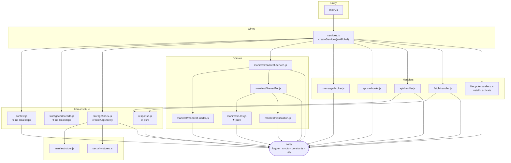
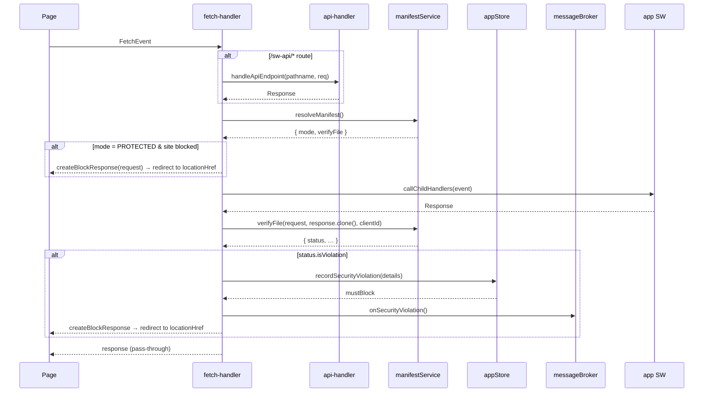

# Service Worker Architecture

## Layers at a glance



★ marks modules with no factory-pattern deps — they are pure functions or thin wrappers with no
mutable state injected.

---

## The `core` object

`services.js` assembles a shared context object and spreads it into most handler factories. `config`
is **not** part of `core` — it is passed only to the two factories that need it
(`createManifestService` and `createInstallHandler`).

```js
const core = {
    swContext, // wrapper around `self` (location, clients, fetch)
    appStore, // all IndexedDB stores + recordSecurityViolation()
    manifestService, // fetchAndStoreManifest, resolveManifest, verifyLocation
    onSecurityViolation, // messageBroker.broadcastSecurityViolation
};
```

`config` (parsed from SW URL params: `appSW`, `manifestUrl`, `manifestSignatureType`,
`manifestSignatureIdentity`) is passed separately:

```js
const manifestService = createManifestService({ swContext, appStore, config });
const installHandler = createInstallHandler({ ...core, config, onInstallDone });
```

`indexedDB` is injected from `swGlobal.indexedDB` (passed into `createDatabase`) rather than
accessed directly from `self`, so all IndexedDB usage is testable.

Which fields each receiver actually uses:

| Module                       | `swContext` | `appStore` | `manifestService` | `onSecurityViolation` _(explicit)_ | `config` |
| ---------------------------- | :---------: | :--------: | :---------------: | :--------------------------------: | :------: |
| fetch-handler                |      ✓      |     ✓      |         ✓         |                 ✓                  |          |
| api-handler                  |             |     ✓      |                   |                 ✓                  |          |
| install-handler              |      ✓      |     ✓      |         ✓         |                                    |    ✓     |
| activate-handler             |      ✓      |     ✓      |                   |                 ✓                  |          |
| appsw-hooks _(via callback)_ |             |     ✓      |         ✓         |                                    |          |

`api-handler` and `activate-handler` use only two `core` fields each; they receive the full spread
because the convenience outweighs the noise. If either module grows, narrowing their deps is the
right call.

---

## Fetch request lifecycle



---

## Module responsibilities

| Module                         | Responsibility                                                                                                  |
| ------------------------------ | --------------------------------------------------------------------------------------------------------------- |
| `main.js`                      | Registers SW event listeners; entry point only                                                                  |
| `services.js`                  | Wires all factories; owns the composition root                                                                  |
| `context.js`                   | Wraps `self` globals so every other module stays testable                                                       |
| `fetch-handler.js`             | Central request interceptor: routes, verifies, blocks                                                           |
| `api-handler.js`               | `/sw-api/*` router: status, warning page, unblock                                                               |
| `lifecycle-handlers.js`        | install (manifest fetch + app SW load) and activate (client claim + rebroadcast)                                |
| `message-broker.js`            | Outbound violation broadcasts + inbound `CLAIM_CONTROL`/`CLIENT_READY` routing                                  |
| `appsw-hooks.js`               | Monkey-patches `importScripts` and `addEventListener` on the SW scope                                           |
| `manifest/manifest-service.js` | Thin composition layer: wires loader + verifier, exposes public API                                             |
| `manifest/manifest-loader.js`  | Manifest I/O: fetch, signature verification, storage (`getLatest`/`getAll`/`fetchAndStore`), singleFlight dedup |
| `manifest/file-verifier.js`    | Rule engine + manifest escalation: 4-step resolution, per-client pinning, action pipeline                       |
| `manifest/rules.js`            | Pure rules evaluation: pathRules resolution, contentRules matching, transforms, hash verification               |
| `manifest/verification.js`     | Async verification: manifest signature, fetch-and-verify location, imported script verification                 |
| `response.js`                  | Pure response builders: block, redirect, warning page                                                           |
| `storage/index.js`             | `appStore` facade; single entry point for all persistence                                                       |
| `storage/indexeddb.js`         | Low-level key-value wrapper over IndexedDB (injected, not accessed via `self`)                                  |
| `storage/manifest-store.js`    | Manifest versioning, dedup, time-based retention (24 h TTL + cap), `getAll` newest-first                        |
| `storage/security-stores.js`   | Block tracking, event log, API token                                                                            |

---

## Manifest escalation in `file-verifier.js`

Every verified request goes through a 4-step escalation. Each step runs the full pipeline (pathRules
→ contentRules → action walk) with the manifest it holds. Steps are skipped or short-circuited as
described below.

| Step         | Source                                               | Condition                                            | On pass                                   | On fail                                  |
| ------------ | ---------------------------------------------------- | ---------------------------------------------------- | ----------------------------------------- | ---------------------------------------- |
| 1 — Pinned   | `clientIdXManifest` (in-memory)                      | Non-navigation request **and** client already pinned | Return result immediately — no escalation | (pin absent → fall through to step 2)    |
| 2 — Latest   | `latestManifest` passed by caller (IndexedDB cache)  | Always tried when no pin                             | Pin client, return result                 | Escalate to step 3                       |
| 3 — Historic | `manifestLoader.getManifestHistory()` (newest-first) | Skipped when `appVersion` already tried in step 2    | Pin client, return result                 | Escalate to step 4                       |
| 4 — Network  | `manifestLoader.fetchAndStoreManifest()`             | Terminal — always runs if steps 1–3 all failed       | Pin client, return result                 | Return violation (no further escalation) |

**Pinning** binds a `clientId` to a specific `manifestInfo` for the duration of the page load.
Navigation requests always bypass the pin and re-enter at step 2, so each new page load can pick up
a newer manifest. Stale pins are pruned lazily via `swContext.matchAllClients()`.

---

## Notes on the split

**What works well**

-   `response.js` and `operations.js` are pure — no injected state, trivially testable.
-   `context.js` isolates every touch of `self`, so all other modules never reference the global
    directly (except the monkey-patching in `appsw-hooks.js`, which is inherently impure).
-   `storage/indexeddb.js` is a stable key-value floor; every store builds on it without leaking
    IndexedDB internals. It is injected via `swGlobal.indexedDB` rather than read from `self`,
    keeping it testable in isolation.
-   `appsw-hooks.js` receives an `onVerifyScript` callback rather than `core` directly — the
    cleanest dep injection pattern in this layer.

**Worth watching**

-   `api-handler.js` receives all of `core` but only uses `appStore` and `onSecurityViolation`. No
    bug, but if the file grows, passing the full context obscures the real surface area.
-   `lifecycle-handlers.js` bundles install and activate. They share no code, and their dep sets
    differ slightly; splitting them would be fine if either grows significantly.
